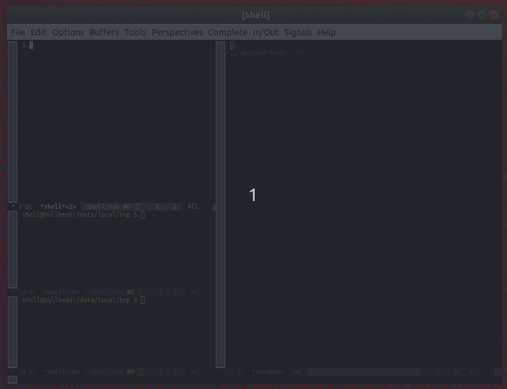

# emacs-conf
My personal Emacs configuration.
See also https://github.com/aviramc/.emacs.d and https://github.com/borfig/emacs-conf
## Installation
```shell
mv ~/.emacs.d{,.orig} || true
ln -s emacs.d ~/.emacs.d
cp emacsclient.desktop ~/.local/share/applications/
chmod +x  ~/.local/share/applications/emacsclient.desktop
```
### gdb completion
Put the content of .gdbinit in ~/.gdbinit.
## Keys
### Global Keys
- *Ctrl-x c*: leave emacs (the default Ctrl-x Ctrl-c is disabled on purpose)
- *Ctrl-Alt-k*: kill current buffer (or Ctrl-Alt-k)
- *Ctrl-Tab*: switch to other window (or Alt-<arrow>)
- *Ctrl-z*: undo last edit
- *Ctrl-y*: redo last edit
- *f5*: maximize window to frame
## Emacs compilation
A wild tale tells lucid works better than gtk3 when using emacs daemon. These are the suggested compilation flags:
```
sudo apt-get install build-essential texinfo libx11-dev libxpm-dev libjpeg-dev libpng-dev libgif-dev libtiff-dev libncurses5-dev libxaw7-dev libgnutls28-dev
wget https://ftp.gnu.org/gnu/emacs/emacs-27.1.tar.xz
tar -xf emacs-27.1.tar.xz
cd emacs-27.1
git apply xterm.c.27.1.patch
./configure --with-x-toolkit=lucid --with-kerberos --with-kerberos5 --with-wide-int --with-mailutils --with-modules
make
sudo make install
systemctl --user enable emacs
sudo apt-get install npm
sudo npm -g install js-beautify
```
## GDB completion / context
The context command is provided by GEF and then sent to emacs using epc.

## Python completion
Support following python and completion from python interpreter.

## GDB / IDA decompiler integration
Have your ida on one machine with epc server running:
```
cd sysroot-of-binaries
python -m epc.server --address 0.0.0.0 --port 19999 builtins
```
The have your gdb init configure this machine ip:
```
gef config ida-interact.host "192.168.99.1"
```
And then you will be able to see one window with the decompiled code from ida and for each decompiled code you can see its assembly (press TAB on a source code line to see the assembly).

