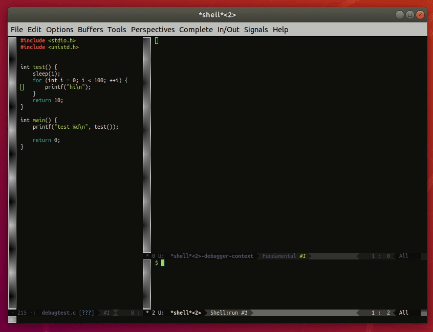

# emacs-conf
My personal Emacs configuration.
See also https://github.com/aviramc/.emacs.d and https://github.com/borfig/emacs-conf
## Installation
```shell
mv ~/.emacs.d{,.orig} || true
ln -s emacs.d ~/.emacs.d
```
### gdb completion
Put the content of .gdbinit in ~/.gdbinit.
## Keys
### Global Keys
- *Ctrl-x c*: leave emacs (the default Ctrl-x Ctrl-c is disabled on purpose)
- *Ctrl-Alt-k*: kill current buffer (or Ctrl-Alt-k)
- *Ctrl-Tab*: switch to other window (or Alt-<arrow>)
- *Ctrl-z*: undo last edit
- *Ctrl-y*: redo last edit
- *f5*: maximize window to frame
## Emacs compilation
A wild tale tells lucid works better than gtk3 when using emacs daemon. These are the suggested compilation flags:
```
sudo apt-get install build-essential textinfo libx11-dev libxpm-dev libjpeg-dev libpng-dev libgif-dev libtiff-dev libncurses-dev libxaw7-dev libgnutls28-dev
wget ftp://ftp.gnu.org/gnu/emacs/emacs-26.3.tar.xz
tar -xf emacs-26.3.tar.xz
cd emacs-26.3
git apply xterm.c.patch
./configure --with-x-toolkit=lucid --with-kerberos --with-kerberos5 --with-wide-int --with-mailutils
make
sudo make install
systemctl --user enable emacs
sudo apt-get install npm
sudo npm -g install js-beautify
```
## GDB completion / context
The context command is provided by GEF and then sent to emacs using epc.
